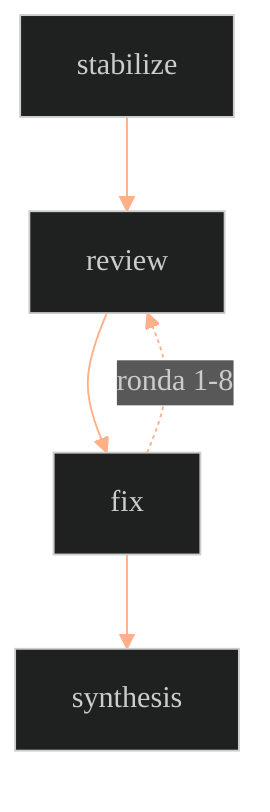

  
el flujo

  <h1 class="fd-cover-title vt-title">De la idea al PR</h1>
  
cómo un agente recorre un proyecto entero — de leer el goal a abrir el pull request.

  
↓ explorá el mapa de arquitectura

---
layout: full
class: fd-mono
---

<ArchitectureCanvas class="h-full" />

---
layout: two-cols
class: fd-mono fd-deepdive
---

deep dive

<h2 class="fd-dd-title vt-title">El loop de review</h2>

Cuando stabilize deja el build en verde, varios
agentes auditan el mismo PR en paralelo. Cada issue que abren se convierte en un
fixer dedicado — chico, aislado, verificable.

El loop entre review y
fix corre hasta <strong>8 rondas</strong>.
Cuando review no encuentra nada nuevo, el flujo sigue a
synthesis.

::right::

---
layout: full
class: fd-mono fd-summary
---

  
resumen

  <h2 class="fd-summary-title vt-title">Toda la arquitectura, otra vez</h2>

  

    <KnowledgePanel :items="[
      { title: 'contexto', sub: 'Obsidian', body: 'El vault es la memoria persistente del proyecto entre sesiones del agente — qué se decidió y por qué.' },
      { title: 'goal → skills', sub: 'criterio', body: 'Leer el goal genera plan.md y design.md. Skills define cuándo un PR está realmente listo.' },
      { title: 'stabilize', sub: 'build verde', body: 'Antes de pedir review, el agente deja tests y lint en verde por su cuenta.' },
      { title: 'review ⇄ fix', sub: 'hasta 8 rondas', body: 'Agentes auditan en paralelo; cada issue se vuelve un fixer dedicado. El loop corre hasta 8 rondas.' },
      { title: 'synthesis', sub: 'resumen final', body: 'Cuando el loop converge, el agente resume el journey completo — listo para pegar en el PR.' },
    ]" />
  

  
de la idea al PR, sin perder el contexto en el camino.

